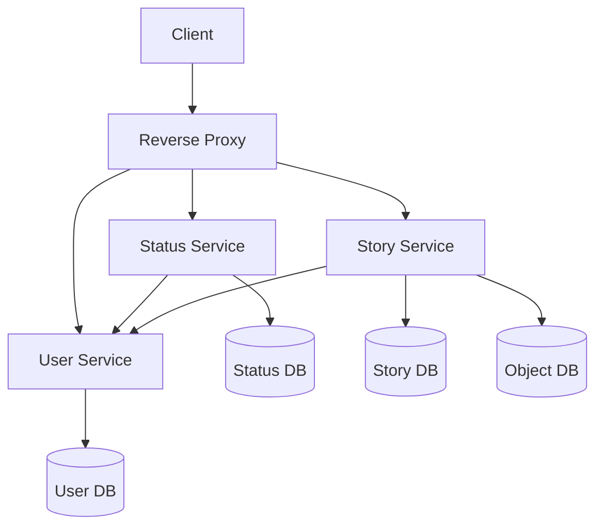

## A Minimal Facebook Clone

### Features

- User Authentication
- Post Status
- Post Stories

### Technologies Used

- React
- Express
- Node
- MongoDB
- Nginx
- Docker

### Run on Your Machine

#### System Requirements

- Linux distro running on a x86_64 architecture CPU
- Around 2GB RAM
- [More Details](https://docs.docker.com/desktop/install/linux-install/#system-requirements)

#### Software Dependencies

- [docker engine](https://docs.docker.com/engine/install/#server)
- [docker compose plugin](https://docs.docker.com/compose/install/linux/#install-using-the-repository)

#### Deploy Locally

- Activate the docker daemon by running `sudo systemctl start docker`
- Clone the repo `git clone https://github.com/rudrowo/mock-book.git`
- `cd ./mock-book`
- `sudo docker compose up -d` &nbsp; :warning: This will take some time
- After that, visit `localhost:6969` to view deployment
- kill deployment with `sudo docker compose down`

### :eyes: :eyes:

### Microservices Architecture

